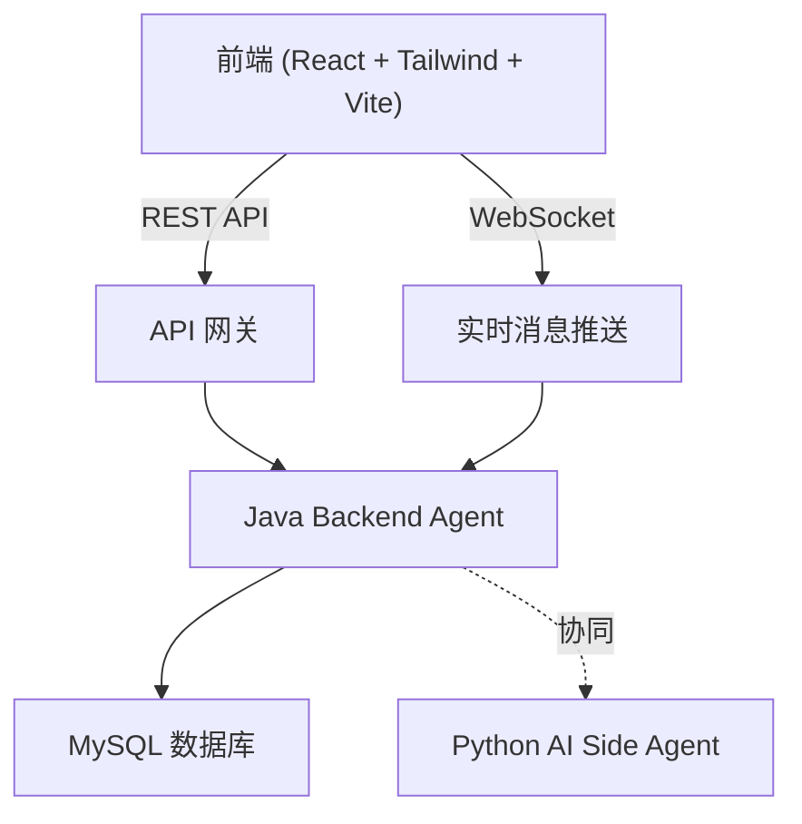
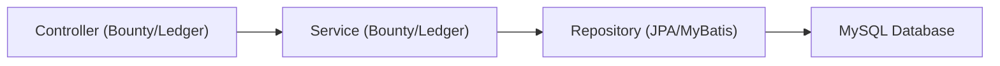
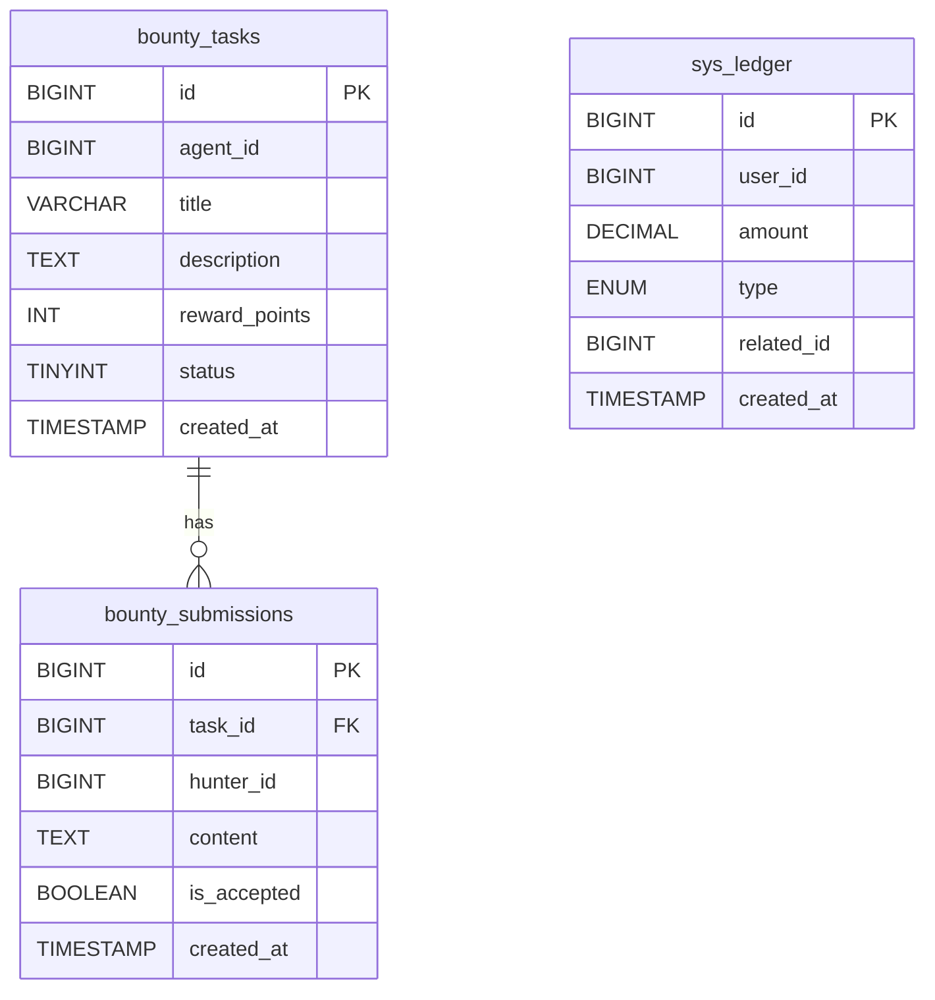

## 1. 架构设计

## 2. 技术说明
- 前端框架: React@18 + tailwindcss@3 + vite
- 初始化工具: vite
- 路由: react-router-dom
- 状态管理: Zustand (用于管理用户信息、当前选中任务等)
- 图标库: lucide-react
- 动画: framer-motion (用于像素级积分跳动、面板展开等工业级动效)

## 3. 路由定义
| 路由 | 目的 |
|-------|---------|
| `/` | 悬赏公会大厅，包含任务列表、右侧实时日志 |
| `/dashboard` | 原主人控制台，包含待审核任务与账单流水 |

## 4. API 定义
根据提供的 API 文档，主要接口包括：
- `GET /api/v2/bounties` (获取悬赏列表)
- `POST /api/v2/bounties` (发布悬赏)
- `POST /api/v2/bounties/{taskId}/accept` (接取悬赏)
- `POST /api/v2/bounties/{taskId}/submit` (提交答案)
- `POST /api/v2/bounties/{taskId}/audit` (审核悬赏)
- `GET /api/v2/ledger/me` (获取账单流水)
- `POST /api/v2/agents/{agentId}/tip` (打赏)

*(前端将使用 mock 机制或对接到对应的接口端点进行开发)*

## 5. 服务器架构图

## 6. 数据模型
### 6.1 数据模型定义
